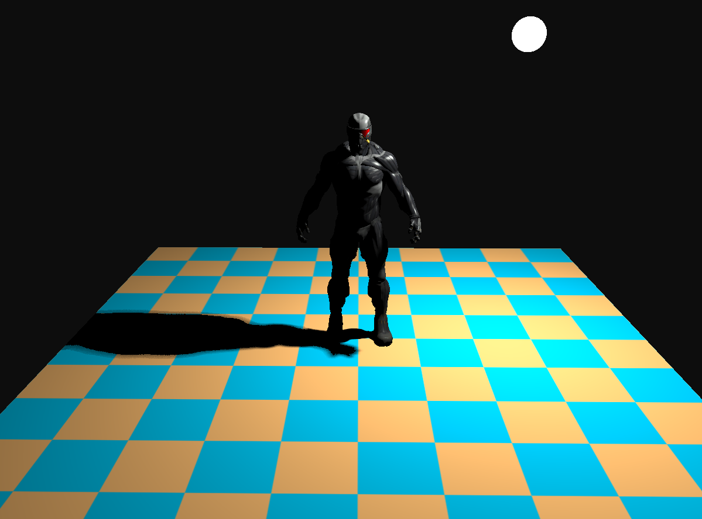

# OpenGLLoadModel

## 配置项目
- 先下载项目
```
git clone
```
- 配置依赖
```
git submodule update --init
```
- 双击 generateProject.bat 即可生成 VS2022 工程文件

## 目标
- 用 glsl 实现了阴影贴图效果
- 硬阴影
- 用 PCF 实现的软阴影
- 用 PCSS 算法实现的软阴影


## 项目结构
- Camera
    - 用欧拉角实现视角的变换
    - 相机可以移动，包含前后左右四个方向，前方向与视线方向一致

- Light
    - 光源采用球形区域光源
    - 配置了 constant、linear、quadratic 三个参数，根据距离会使光强衰弱

- Material 
    - 包含 环境光、漫反射、镜面反射
    - 设置了纹理，每个材质的值可以为固定值或者纹理贴图

- 用 assimp 库做模型导入
- 包装 Shader 类，用于加载和配置shader

## 外部库依赖
- assimp
- glad
- glfw
- glm
- spdlog
- stb
- 用 premake 管理项目